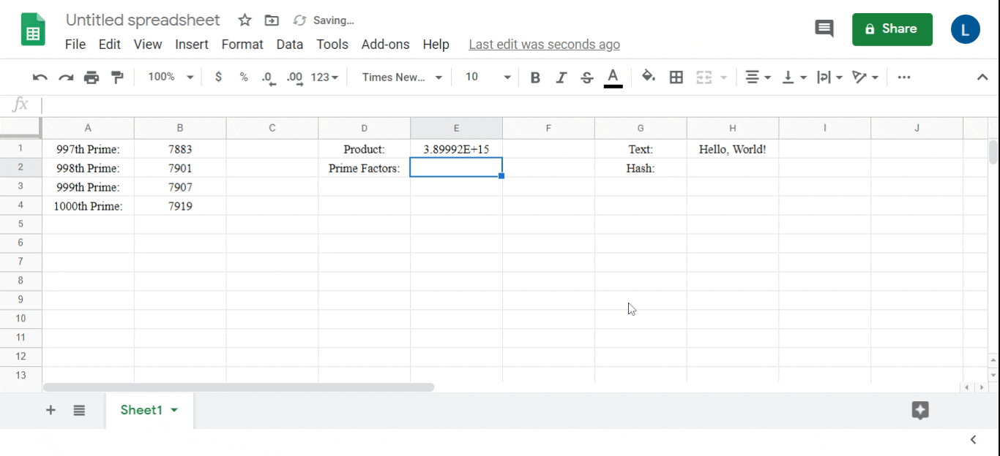

# Google Sheets Cryptography
This repo contains a set of Google Sheets add-on functions for encryption and cryptographic analysis.

Disclaimer: These functions are not written for security and some send data to remote APIs.  DO NOT USE THIS IN SECURITY-CRITICAL APPLICATIONS.
## Example

## Installation
These functions are not part of an add-on (yet), so they must be installed manually.  Still, installation is easy.  From [Google's guide](https://developers.google.com/apps-script/guides/sheets/functions):
1. Copy crypto.gs to your clipboard.  You can pick and choose which functions you want to include.  You can also download crypto.gs by cloning this repo from the command line: `git clone https://github.com/LuChatri/spreadsheet-crypto.git`
2. Open the spreadsheet you want to add the functions to.
3. Select the menu item **Tools > Script editor**. If you are presented with a welcome screen, click **Blank Project** on the left to start a new project.
4. Paste the code into the script editor.
5. Select the menu item **File > Save**. Give the script project a name and click **OK**.  Depending on what functions you are adding, you may have to grant the code permission to access external resources.

You should now be able to use the functions in your spreadsheet.
## Current Functions
- Encryption
  - caesarShift - Implements a common Caesar Cipher
- Hashing
  - Hash - Support hashing in:
     - Blake2b-256, -384, and -512
     - Blake2s-128 and -256
     - HighwayHash-64, -128, and -256
     - MD4 and MD5
     - SHA1, 256, 384, 512, and 512-256
     - SHA3-384 and -512
     - Hex, Base64, and Base32 formats
     - Anything supported by [the hashify API](https://hashify.net/)
- Primes and Factoring
	 - factorization - Find all factors of a number.  Suitable for numbers within JavaScript's integer limit of 2^53-1.
	 - nPrimes - Get *n* primes greater than a value.
	 - primesBetween - Get all primes between two numbers.
	 - primeFactorization - Find the prime factors of a number.  Suitable for numbers within JavaScript's integer limit of 2^53-1.
- Other
  - chunk - Break a string into chunks of a given size.
  - strToBase - Convert a string to a number of any base.  Suitable for any size of number.  For very large numbers, pass *n* as a string or Google Sheets will truncate it.
